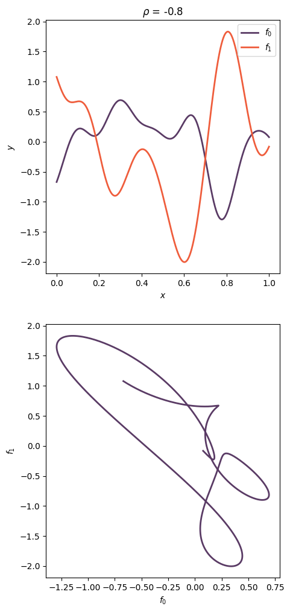

# BEACON: Continuous Bi-objective Benchmark Problems with Explicit Adjustable COrrelatioN control 

This project provides a framework for optimizing BEACON problems using the `pymoo` library. It includes classes for defining the problem, tracking convergence, and running the optimization.

## Requirements

- Python
- pip

## Installation

Install the required packages using pip:

```bash
pip install -r requirements.txt
```

The **pymoo** package may need compilation for significant performance improvements. If you encounter issues, consider installing the package from source. And see the [pymoo documentation](https://github.com/anyoptimization/pymoo) for more details.

## Usage

### BEACON Class

The `BEACON` class is used to define the problem parameters and load/save problem configurations.

### BEACONProblem Class

The `BEACONProblem` class encapsulates the BEACON problem into a `pymoo` problem.

### BEACONProblemOptimiser Class

The `BEACONProblemOptimiser` class is used to optimize a BEACON problem using a specified `pymoo` algorithm.

### Example

```python
from pymoo.algorithms.moo.nsga2 import NSGA2
from BEACON import *

lb, ub = 0., 1.

# Define the BEACON problem, example initialisation
beacon = BEACON(
    num_features = 1000,
    input_dim = 2,
    lengthscale = 0.01,
    correlation = 0.5,
)

# Save the problem to a file if needed
beacon.save_problem(lb=lb, ub=ub)

# Load problem from file if you have a pre-defined problem
beacon.load_problem_from_file('path/to/problem.npz')

# Define the BEACON problem for pymoo
problem = BEACONProblem(beacon_sampler=beacon, xl=lb, xu=ub)

# Define the optimization algorithm, e.g., NSGA2
algorithm = NSGA2(pop_size=100)

# Create the optimizer
optimizer = BEACONProblemOptimiser(problem=problem, algorithm=algorithm, lb=lb, ub=ub, iteration=0)

# Run the optimization
result = optimizer.minimise_correlated_problem(n_gen=100, save_history=False)
```

### Example Problem

Example of a problem generated with a correlation of -0.8, a lengthscale of 0.1, and 1 decision variable



## Utility Functions

Assuming you have performed computational experiments using this package, we provide some utility functions to aid with the results analysis

### Plotting Empirical Attainment Front

For plotting the empirical attainment front, you may need to install the package from the [source](https://github.com/nabenabe0928/empirical-attainment-func)

```
git clone https://github.com/nabenabe0928/empirical-attainment-func
cd empirical-attainment-func
pip install .
```

```python
from utils import *

nsga_solutions = get_solutions(data_source='data', n_var=10, corr=0.5, algorithm="NSGA2", iterations=20)
plot_eaf(data=nsga_solutions, name="NSGA2", nvar=10, corr=0.5)
```

### Plotting Convergence Rates

```python
from utils import *

n_vars = [1, 5, 10, 20]
correlations = [1., 0.5, 0., -0.5, -1.]

hv = get_hv_ref_point(data_source='data', n_vars=n_vars, correlations=correlations, algorithms=["NSGA2"], population_size=100, iterations=100)

for nvar in n_vars:
    for corr in correlations:
            plot_convergence(data_source='data', hv=hv, n_var=nvar, corr=corr, algorithms=["NSGA2"], iterations=20, save_data=True)
            plot_convergence_from_hypervolume_data(data_source='./plots/hypervolume_data', n_var=nvar, corr=corr, algorithms=["NSGA2"])
```


## License

This project is licensed under the MIT License. See the `LICENSE` file for more details.